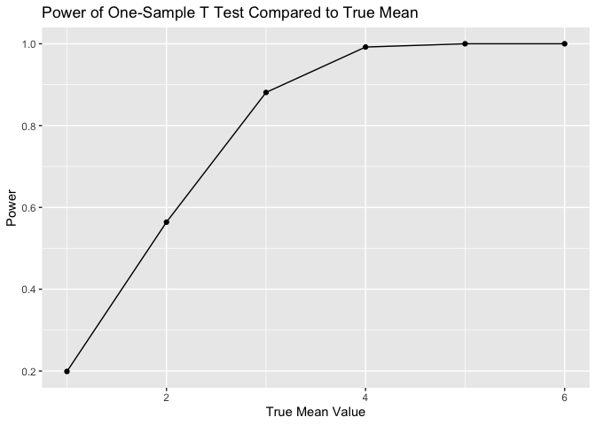
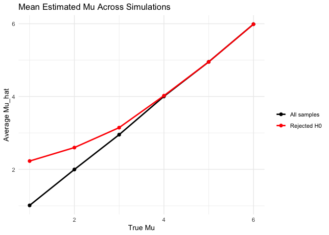
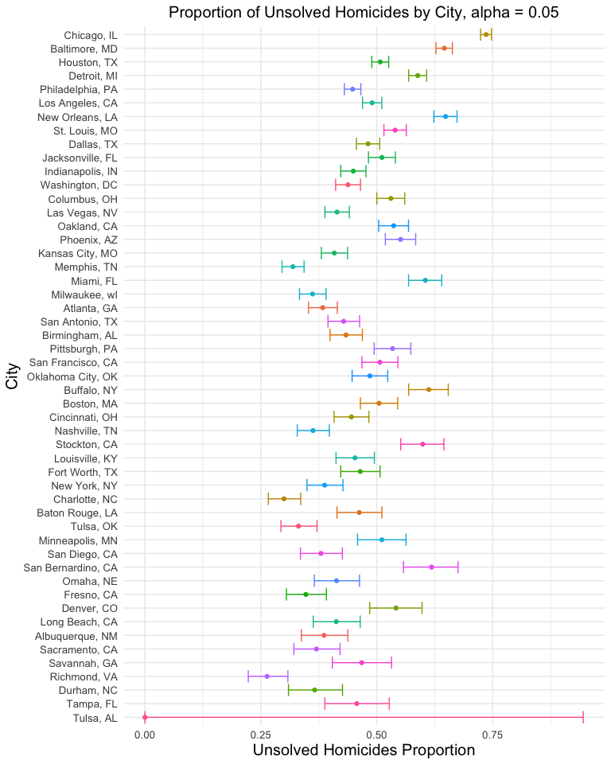

p8105_hw5_tp2806
================
Tejashree Prakash
2025-11-13

# Problem 1: Birthday Simulation

#### Creating birthday function

``` r
bday_simulation <- function(ngroup) {
  birthdays = sample(1:365, ngroup, replace = TRUE)
  repeated_bday = length(unique(birthdays)) < ngroup
  repeated_bday
}

#check if TRUE/FALSE whether two people in random group of 10 share bday 
bday_simulation(10)
```

    ## [1] FALSE

#### Run the function 10000 times and compute probabilities

``` r
bday_results <-
  expand_grid(
  group_size = 2:50,
  iter = 1:10000 #run function 10000 times
  ) %>%
  mutate(
    results = map2_lgl(group_size, iter, ~ bday_simulation(.x)) #runs bday_simulation once per row, and 10000 iterations per group size
  ) %>%
  group_by(group_size) %>%
  summarise(
    repeat_probability = mean(results), .groups = "drop" #probability of a repeated bday
  )
```

#### Visualize the probabilities

``` r
#Summary table
bday_results %>%
  slice_head(n = 5) %>% #just first 5 rows 
  knitr::kable(
    digits = 4,
    caption = "Estimated probability that at least two people in a group will share a birthday"
  )
```

| group_size | repeat_probability |
|-----------:|-------------------:|
|          2 |             0.0024 |
|          3 |             0.0076 |
|          4 |             0.0174 |
|          5 |             0.0266 |
|          6 |             0.0393 |

Estimated probability that at least two people in a group will share a
birthday

``` r
#Produce probability plot 
bday_results %>%
  ggplot(aes(x = group_size, y = repeat_probability)) + 
  geom_point() + 
  geom_line() +
  labs(
    x = "Group Size (N)",
    y = "Estimated probability of a shared birthday",
    title = "Estimated probability that at least two people in a group share a birthday"
  )
```

<!-- -->

After producing a dataframe in which there is a birthday simulation ran
10000 times for each group size from 2 to 50, there is a strong positive
trend between group size and estimated probability of sharing a birthday
with at least one other person within one group. Essentially, as group
size increases this estimated probability of sharing a birthday with at
least one other person increases.

# Problem 2: One-Sample T-Test Simulation

#### Creating function

``` r
ttest_simulation <- function(mu, n = 30, sigma = 5) { #fixing n and sigma
  x = rnorm(n, mean = mu, sd = sigma)
  test_stat = t.test(x, mu = 0) #set mu to 0 (null hypothesis), produce mu_hat (estimate) and p-value 
  broom::tidy(test_stat) %>%
    select(estimate, p.value) %>%
    rename(
      mu_hat = estimate,
      p_value = p.value
    )
}
```

#### Running the simulation - comparing true_mu against hypothesis testing.

``` r
ttest_results <- 
  expand.grid(
    mu_true = 1:6, 
    iter = 1:1000 #iterate t test 1000 times per mu_true 
  ) %>%
  mutate(
    sim = map(mu_true, ttest_simulation)
  ) %>%
  unnest(sim) %>%
  mutate(
    reject = p_value < 0.05 #only want significant results 
  )

ttest_results %>%
  group_by(mu_true) %>% 
  slice_head(n = 3) %>% #only show first 3 iterations of each mu           
  knitr::kable(
    digits = 3,
    caption = "T-Test Simulation Results with Estimates"
  )
```

| mu_true | iter | mu_hat | p_value | reject |
|--------:|-----:|-------:|--------:|:-------|
|       1 |    1 |  0.858 |   0.314 | FALSE  |
|       1 |    2 |  1.266 |   0.181 | FALSE  |
|       1 |    3 |  2.022 |   0.005 | TRUE   |
|       2 |    1 |  0.995 |   0.311 | FALSE  |
|       2 |    2 |  2.879 |   0.004 | TRUE   |
|       2 |    3 |  1.982 |   0.018 | TRUE   |
|       3 |    1 |  3.608 |   0.000 | TRUE   |
|       3 |    2 |  4.949 |   0.000 | TRUE   |
|       3 |    3 |  3.201 |   0.001 | TRUE   |
|       4 |    1 |  4.079 |   0.001 | TRUE   |
|       4 |    2 |  5.055 |   0.000 | TRUE   |
|       4 |    3 |  3.536 |   0.002 | TRUE   |
|       5 |    1 |  3.711 |   0.001 | TRUE   |
|       5 |    2 |  5.024 |   0.000 | TRUE   |
|       5 |    3 |  5.665 |   0.000 | TRUE   |
|       6 |    1 |  6.660 |   0.000 | TRUE   |
|       6 |    2 |  5.634 |   0.000 | TRUE   |
|       6 |    3 |  6.222 |   0.000 | TRUE   |

T-Test Simulation Results with Estimates

This table demonstrates 3 of the 1000 simulation iterations per true mu
value. Each true mu value is compared with a hypothesis testing
population estimate of mu, its p-value, and whether the null hypothesis
was rejected or not (indicating significance).

#### Visualizing Power and Estimated Mu vs True Mu

``` r
power <- ttest_results %>%
  group_by(mu_true) %>%
  summarise(
    power = mean(reject)
  )

power %>%
  ggplot(aes(x = mu_true, y = power)) + 
  geom_point() + 
  geom_line() + 
  labs(
    x="True Mean Value",
    y="Power",
    title = "Power of One-Sample T Test Compared to True Mean"
  )
```

<!-- -->
<br> The power of a test is the probability of rejecting the null when
it should be rejected. The plot above demonstrates that a larger true
mean value leads to a greater power. As the true mean moves further from
0, there is a larger effect size. Therefore, a larger effect size leads
to increase in power.

``` r
#Get average of mu_hat grouping by mu_true 
mean_df <- ttest_results %>%
  group_by(mu_true) %>%
  summarise(means = mean(mu_hat), .groups = "drop")

#Get average of mu_hat only when null hypothesis is rejected
mean_reject_df <- ttest_results %>%
  filter(reject == TRUE) %>% 
  group_by(mu_true) %>%
  summarise(mean_reject = mean(mu_hat), .groups = "drop")

#Combine dfs
mean_results <- left_join(mean_df, mean_reject_df, by = "mu_true")

#Produce plot to visualize average estimate of mu_hat when comparing mu_hat and mu_true
ggplot(mean_results, aes(x = mu_true)) +
  geom_line(aes(y = means, color = "All samples"), linewidth = 1) +
  geom_point(aes(y = means, color = "All samples"), size = 2) +

  geom_line(aes(y = mean_reject, color = "Rejected H0"), linewidth = 1) +
  geom_point(aes(y = mean_reject, color = "Rejected H0"), size = 2) +

  labs(
    title = "Mean Estimated Mu Across Simulations",
    x = "True Mu",
    y = "Average Mu_hat"
  ) +
  scale_color_manual(values = c("All samples" = "black",
                                "Rejected H0" = "red"),
                     name = "") +
  theme_minimal() 
```

<!-- -->
<br> This plot demonstrates how the true mean value (true mu) relates to
the average estimated mean value obtained across the simulation,
comparing all samples to only those with the null hypothesis rejected.
Overall, the average mean value equals the true mean value across all
samples. However, they were not equal among the rejected null samples
when the mean values were lower in magnitude. This demonstrates a form
of bias where the estimated and true mean values only equal one another
when the means are relatively greater in magnitude.

# Problem 3: Prop.Test

#### Downloading and seeing raw data

``` r
#Load data
homicide_df <- read_csv("data/homicide-data.csv")
```

    ## Rows: 52179 Columns: 12
    ## ── Column specification ────────────────────────────────────────────────────────
    ## Delimiter: ","
    ## chr (9): uid, victim_last, victim_first, victim_race, victim_age, victim_sex...
    ## dbl (3): reported_date, lat, lon
    ## 
    ## ℹ Use `spec()` to retrieve the full column specification for this data.
    ## ℹ Specify the column types or set `show_col_types = FALSE` to quiet this message.

``` r
#Add city_state variable 
homicide_df <- homicide_df %>%
  mutate(city_state = str_c(city, ", ", state)) 

knitr::kable(head(homicide_df, 5))
```

| uid | reported_date | victim_last | victim_first | victim_race | victim_age | victim_sex | city | state | lat | lon | disposition | city_state |
|:---|---:|:---|:---|:---|:---|:---|:---|:---|---:|---:|:---|:---|
| Alb-000001 | 20100504 | GARCIA | JUAN | Hispanic | 78 | Male | Albuquerque | NM | 35.09579 | -106.5386 | Closed without arrest | Albuquerque, NM |
| Alb-000002 | 20100216 | MONTOYA | CAMERON | Hispanic | 17 | Male | Albuquerque | NM | 35.05681 | -106.7153 | Closed by arrest | Albuquerque, NM |
| Alb-000003 | 20100601 | SATTERFIELD | VIVIANA | White | 15 | Female | Albuquerque | NM | 35.08609 | -106.6956 | Closed without arrest | Albuquerque, NM |
| Alb-000004 | 20100101 | MENDIOLA | CARLOS | Hispanic | 32 | Male | Albuquerque | NM | 35.07849 | -106.5561 | Closed by arrest | Albuquerque, NM |
| Alb-000005 | 20100102 | MULA | VIVIAN | White | 72 | Female | Albuquerque | NM | 35.13036 | -106.5810 | Closed without arrest | Albuquerque, NM |

This dataset contains information on homicides in 50 large U.S. cities,
as shown in the city_state variable. Each row is a single homicide case.

<br> Key variables include: \* uid - homicide case identification \*
reported_date - date the case was initially reported \* victim_last;
victim_first; victim_race; victim_age; victim_sex describe the
demographic information about the victim of the homicide case \*
disposition - states the case status (closed without arrest, closed by
arrest, open/no arrest)

#### Summarizing total number of homicides and unsolved homicdies by city

``` r
homicide_summary <- 
  homicide_df %>%
  group_by(city_state) %>%
  summarise(
    total_homicides = n(), 
    unsolved_homicides = sum(disposition %in% c("Closed without arrest", "Open/No arrest")) #sum the two unsolved categories together
  ) %>%
  arrange(desc(total_homicides))

knitr::kable(head(homicide_summary, 15))
```

| city_state       | total_homicides | unsolved_homicides |
|:-----------------|----------------:|-------------------:|
| Chicago, IL      |            5535 |               4073 |
| Philadelphia, PA |            3037 |               1360 |
| Houston, TX      |            2942 |               1493 |
| Baltimore, MD    |            2827 |               1825 |
| Detroit, MI      |            2519 |               1482 |
| Los Angeles, CA  |            2257 |               1106 |
| St. Louis, MO    |            1677 |                905 |
| Dallas, TX       |            1567 |                754 |
| Memphis, TN      |            1514 |                483 |
| New Orleans, LA  |            1434 |                930 |
| Las Vegas, NV    |            1381 |                572 |
| Washington, DC   |            1345 |                589 |
| Indianapolis, IN |            1322 |                594 |
| Kansas City, MO  |            1190 |                486 |
| Jacksonville, FL |            1168 |                597 |

As seen in this table, Chicago has the greatest number of total
homicides and unsolved homicides. Baltimore has the next greatest number
of total unsolved homicides, although it is only the fourth highest
total homicide count.

#### Prop.Test for Baltimore

``` r
baltimore <- homicide_summary %>%
  filter(city_state == "Baltimore, MD")

#Run proportion test 
baltimore_test <-
  prop.test(
  x = baltimore$unsolved_homicides,
  n = baltimore$total_homicides
)

#Tidy df
baltimore_test=
  baltimore_test %>% 
  broom::tidy() %>%
  select(estimate, conf.low, conf.high, p.value) %>%
  knitr::kable(
    caption = "Proportion and Confidence Intervals of Unsolved Homicides in Baltimore, MD",
    digits = 4
  )
```

#### Prop.Test for All Cities

``` r
#Run proportion test for each city
all_city_results <- 
  homicide_summary %>%
  mutate(
    prop = map2(unsolved_homicides, total_homicides,
                ~prop.test(.x, .y)),
    prop_tidy = map(prop, broom::tidy) #Clean 
  ) %>%
  unnest(prop_tidy) %>%
  select(city_state, total_homicides, unsolved_homicides, estimate, conf.low, conf.high)
```

    ## Warning: There was 1 warning in `mutate()`.
    ## ℹ In argument: `prop = map2(unsolved_homicides, total_homicides, ~prop.test(.x,
    ##   .y))`.
    ## Caused by warning in `prop.test()`:
    ## ! Chi-squared approximation may be incorrect

``` r
all_city_results %>%
  arrange(desc(estimate)) %>%
  knitr::kable(
    digits = 4,
    caption = "Proportion of Unsolved Homicides for All Cities"
  )
```

| city_state | total_homicides | unsolved_homicides | estimate | conf.low | conf.high |
|:---|---:|---:|---:|---:|---:|
| Chicago, IL | 5535 | 4073 | 0.7359 | 0.7240 | 0.7474 |
| New Orleans, LA | 1434 | 930 | 0.6485 | 0.6231 | 0.6732 |
| Baltimore, MD | 2827 | 1825 | 0.6456 | 0.6276 | 0.6632 |
| San Bernardino, CA | 275 | 170 | 0.6182 | 0.5577 | 0.6753 |
| Buffalo, NY | 521 | 319 | 0.6123 | 0.5688 | 0.6541 |
| Miami, FL | 744 | 450 | 0.6048 | 0.5686 | 0.6400 |
| Stockton, CA | 444 | 266 | 0.5991 | 0.5517 | 0.6447 |
| Detroit, MI | 2519 | 1482 | 0.5883 | 0.5688 | 0.6076 |
| Phoenix, AZ | 914 | 504 | 0.5514 | 0.5185 | 0.5839 |
| Denver, CO | 312 | 169 | 0.5417 | 0.4846 | 0.5977 |
| St. Louis, MO | 1677 | 905 | 0.5397 | 0.5154 | 0.5637 |
| Oakland, CA | 947 | 508 | 0.5364 | 0.5041 | 0.5685 |
| Pittsburgh, PA | 631 | 337 | 0.5341 | 0.4943 | 0.5735 |
| Columbus, OH | 1084 | 575 | 0.5304 | 0.5002 | 0.5605 |
| Jacksonville, FL | 1168 | 597 | 0.5111 | 0.4820 | 0.5401 |
| Minneapolis, MN | 366 | 187 | 0.5109 | 0.4585 | 0.5631 |
| Houston, TX | 2942 | 1493 | 0.5075 | 0.4892 | 0.5257 |
| San Francisco, CA | 663 | 336 | 0.5068 | 0.4681 | 0.5454 |
| Boston, MA | 614 | 310 | 0.5049 | 0.4646 | 0.5451 |
| Los Angeles, CA | 2257 | 1106 | 0.4900 | 0.4692 | 0.5109 |
| Oklahoma City, OK | 672 | 326 | 0.4851 | 0.4468 | 0.5236 |
| Dallas, TX | 1567 | 754 | 0.4812 | 0.4562 | 0.5062 |
| Savannah, GA | 246 | 115 | 0.4675 | 0.4041 | 0.5319 |
| Fort Worth, TX | 549 | 255 | 0.4645 | 0.4223 | 0.5072 |
| Baton Rouge, LA | 424 | 196 | 0.4623 | 0.4142 | 0.5110 |
| Tampa, FL | 208 | 95 | 0.4567 | 0.3881 | 0.5270 |
| Louisville, KY | 576 | 261 | 0.4531 | 0.4121 | 0.4948 |
| Indianapolis, IN | 1322 | 594 | 0.4493 | 0.4223 | 0.4766 |
| Philadelphia, PA | 3037 | 1360 | 0.4478 | 0.4300 | 0.4657 |
| Cincinnati, OH | 694 | 309 | 0.4452 | 0.4080 | 0.4831 |
| Washington, DC | 1345 | 589 | 0.4379 | 0.4112 | 0.4649 |
| Birmingham, AL | 800 | 347 | 0.4338 | 0.3992 | 0.4690 |
| San Antonio, TX | 833 | 357 | 0.4286 | 0.3948 | 0.4630 |
| Las Vegas, NV | 1381 | 572 | 0.4142 | 0.3881 | 0.4407 |
| Omaha, NE | 409 | 169 | 0.4132 | 0.3653 | 0.4627 |
| Long Beach, CA | 378 | 156 | 0.4127 | 0.3629 | 0.4643 |
| Kansas City, MO | 1190 | 486 | 0.4084 | 0.3804 | 0.4370 |
| New York, NY | 627 | 243 | 0.3876 | 0.3494 | 0.4271 |
| Albuquerque, NM | 378 | 146 | 0.3862 | 0.3373 | 0.4376 |
| Atlanta, GA | 973 | 373 | 0.3834 | 0.3528 | 0.4148 |
| San Diego, CA | 461 | 175 | 0.3796 | 0.3354 | 0.4258 |
| Sacramento, CA | 376 | 139 | 0.3697 | 0.3212 | 0.4209 |
| Durham, NC | 276 | 101 | 0.3659 | 0.3096 | 0.4261 |
| Nashville, TN | 767 | 278 | 0.3625 | 0.3286 | 0.3977 |
| Milwaukee, wI | 1115 | 403 | 0.3614 | 0.3333 | 0.3905 |
| Fresno, CA | 487 | 169 | 0.3470 | 0.3051 | 0.3914 |
| Tulsa, OK | 583 | 193 | 0.3310 | 0.2932 | 0.3711 |
| Memphis, TN | 1514 | 483 | 0.3190 | 0.2957 | 0.3433 |
| Charlotte, NC | 687 | 206 | 0.2999 | 0.2661 | 0.3359 |
| Richmond, VA | 429 | 113 | 0.2634 | 0.2229 | 0.3083 |
| Tulsa, AL | 1 | 0 | 0.0000 | 0.0000 | 0.9454 |

Proportion of Unsolved Homicides for All Cities

#### Visualizing Estimates and CIs for Each City

``` r
all_city_results %>%
  arrange(desc(unsolved_homicides)) %>%
  ggplot(aes(
    x = reorder(city_state, unsolved_homicides), #order from low to high proportion of homicides 
    y = estimate, 
    color = city_state
  )) + 
  geom_point(show.legend = FALSE) + #don't want crowded X axis
  geom_errorbar(aes(ymin = conf.low, ymax = conf.high), show.legend = FALSE) + 
  labs(
    x = "City",
    y = "Unsolved Homicides Proportion", 
    title = "Proportion of Unsolved Homicides by City, alpha = 0.05"
  ) +
  coord_flip() + 
  theme_minimal() + 
  theme(
    plot.title = element_text(hjust = 0.5, size = 15),
    axis.text.x = element_text(size = 10),
    axis.text.y = element_text(size = 10),
    axis.title.x = element_text(size = 15),
    axis.title.y = element_text(size = 15)
  )
```

<!-- -->

This figure shows the estimated proportion of unsolved homicides to
total homicides in 51 major US cities. Chicago, New Orleans, and
Baltimore have the greatest proportion of unsolved homicides compared to
the other cities. Tampa and Tulsa have the lowest proportion. However,
Tulsa has a proportion of 0 with a very large error, indicating that the
data reported for this city may not be accurate.
